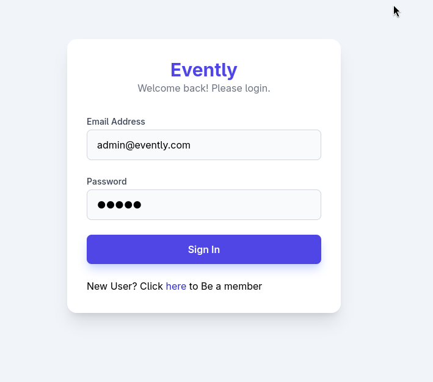
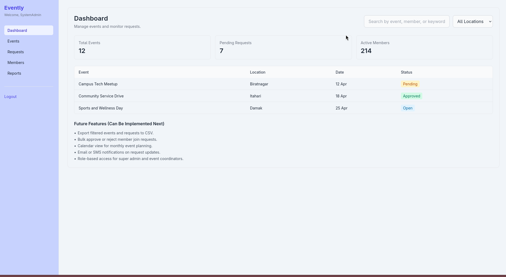
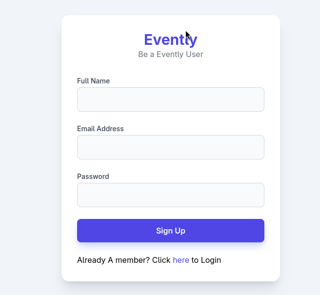

# Evently Demo

Evently Demo is a Java web app for campus-style event management, built with JSP, Servlets, Maven, and PostgreSQL.

It supports:
- Registration and login
- Role-based redirect (admin and member)
- Event creation and listing
- Event joining for members
- Basic admin dashboard metrics

## Tech Stack

- Java 11
- Maven (WAR packaging)
- Jakarta Servlet API 6.1
- JSP
- PostgreSQL
- Embedded Jetty via Maven plugin (run mode)

## Project Layout

- src/main/java/com/eventmgmt/demo/controller: Servlet endpoints
- src/main/java/com/eventmgmt/demo/DAO: Data access classes
- src/main/java/com/eventmgmt/demo/model: Domain models
- src/main/java/com/eventmgmt/demo/util: Database connection utility
- src/main/webapp: JSP views and WEB-INF

## Requirements

- Java 11+
- Maven 3.8+
- PostgreSQL instance

## Database Setup

Connection details are currently hardcoded in:
- src/main/java/com/eventmgmt/demo/util/DBconnection.java

Minimum schema used by current DAOs:

users table:

```sql
CREATE TABLE users (
	id SERIAL PRIMARY KEY,
	username VARCHAR(100) NOT NULL,
	email VARCHAR(150) NOT NULL UNIQUE,
	password VARCHAR(255) NOT NULL,
	role VARCHAR(20) NOT NULL DEFAULT 'MEMBER'
);
```

events table:

```sql
CREATE TABLE events (
	id SERIAL PRIMARY KEY,
	title VARCHAR(200) NOT NULL,
	description TEXT,
	location VARCHAR(200),
	event_date TIMESTAMP NOT NULL,
	status VARCHAR(20) NOT NULL DEFAULT 'APPROVED'
);
```

registrations table:

```sql
CREATE TABLE registrations (
	id SERIAL PRIMARY KEY,
	user_id INT NOT NULL REFERENCES users(id) ON DELETE CASCADE,
	event_id INT NOT NULL REFERENCES events(id) ON DELETE CASCADE,
	phone VARCHAR(25),
	age INT,
	preference VARCHAR(80),
	UNIQUE (user_id, event_id)
);
```

If your database already has `registrations` without these columns, run:

```sql
ALTER TABLE registrations
ADD COLUMN IF NOT EXISTS phone VARCHAR(25),
ADD COLUMN IF NOT EXISTS age INT,
ADD COLUMN IF NOT EXISTS preference VARCHAR(80);
```

## Run Locally

Option 1 (recommended):

```bash
./start-server.sh
```

This script attempts to free port 8080 and starts Jetty using Maven.

Option 2:

```bash
./mvnw -DskipTests org.eclipse.jetty.ee10:jetty-ee10-maven-plugin:12.0.15:run
```

## Build

```bash
./mvnw clean package
```

WAR output is generated in target.

## Main Routes

- GET /index.jsp: Login page
- GET /register.jsp: Registration page
- POST /registerProcess: Create account
- POST /loginProcess: Authenticate user
- GET /admin-dashboard: Admin dashboard
- GET /Member-dashboard: Member dashboard
- POST /addEvent: Create event
- POST /joinEvent: Join event
- GET /logout: Logout and clear session

## Security Notes

- Passwords are currently checked and stored in plain text.
- Database credentials are committed in source.

Before production use:
- Use BCrypt (or similar) for password hashing.
- Move DB credentials to environment variables or external config.
- Add CSRF protection and stronger input validation.

## Screenshots






